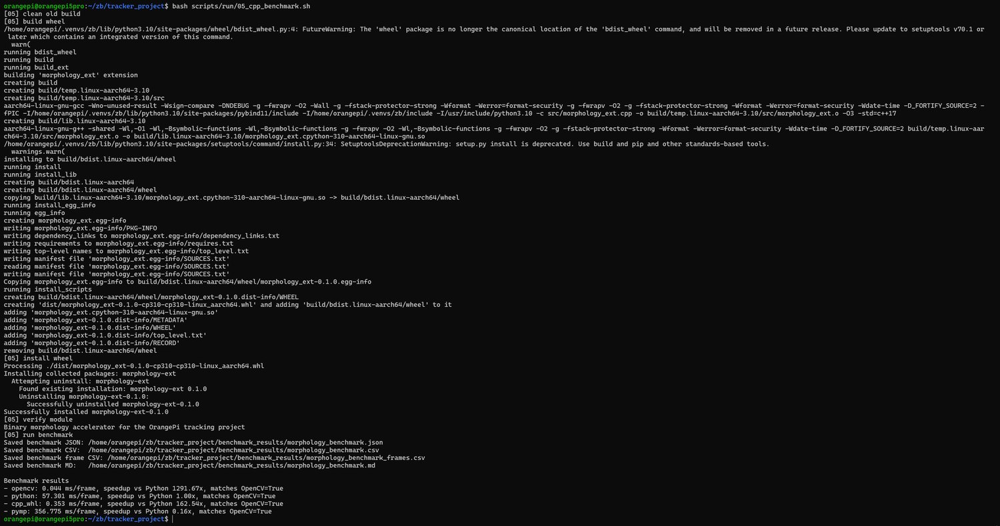

# OrangePi 双自由度云台目标跟踪系统

本项目是“综合设计实践 B”的大作业工程代码。当前主线目标很明确：在 OrangePi 5 Pro / RK3588S 上，用 USB 摄像头采集画面，用 HSV 传统视觉识别高对比目标，再通过 PCA9685 控制两个舵机，让目标尽量保持在画面中心。

当前版本把原来的网页监控升级成了**网页远程控制台**：浏览器里可以看实时画面、查看状态、中心自动标定、只读显示当前 HSV、开始跟踪、急停和复位。网页启动后默认不控制舵机，也不会自动回中，必须先把目标放到画面中心完成自动标定，再点击开始跟踪。

## 项目材料

- 演示视频：[百度网盘链接](https://pan.baidu.com/s/1XZiJAh4sCwHBI5ZsC6_X-w?pwd=fva9)
- GitHub 仓库：[yys806/zb_tracker_project](https://github.com/yys806/zb_tracker_project)
- 完整命令文档：[docs/TEST_COMMANDS.md](docs/TEST_COMMANDS.md)
- 详细接线表：[docs/wiring_table.xlsx](docs/wiring_table.xlsx)
- 完整课程报告：[报告/orange_pi_tracker_report/main.pdf](报告/orange_pi_tracker_report/main.pdf)

## 效果预览

| 实际接线 | 网页真实跟踪 |
| --- | --- |
|  |  |

| FPS 曲线 | 中心误差曲线 | 云台角度曲线 |
| --- | --- | --- |
|  |  |  |

## 实验结果摘要

代表性真实跟踪运行目录：`logs/20260524_013921`。

| 指标 | 数值 |
| --- | ---: |
| 总帧数 | 2576 |
| 平均 FPS | 23.112 |
| 目标找到率 | 36.80% |
| 平均水平中心误差 | 68.91 px |
| 平均垂直中心误差 | 44.70 px |
| 最大水平中心误差 | 307.00 px |
| 最大垂直中心误差 | 174.00 px |
| 目标丢失次数 | 2 |
| 平均重新捕获时间 | 0.764 s |

说明：该组数据来自完整调试过程，期间存在放下目标、移出画面、调整网页按钮等操作，因此目标找到率偏低。正式展示时可在干净背景下重新采集一组“便利贴始终在画面内”的标准数据。

## C++ wheel 加速实验

项目实现了一个 C++/pybind11 形态学算子并编译为 wheel，和 Python、OpenCV、pymp 后端做了对比。第 5 步 benchmark 结果如下：

| 后端 | 平均耗时 ms/frame | 相对 Python 加速比 | 输出是否匹配 OpenCV |
| --- | ---: | ---: | --- |
| Python | 57.301 | 1.00x | 是 |
| OpenCV | 0.044 | 1291.67x | 是 |
| C++ wheel | 0.353 | 162.54x | 是 |
| pymp | 356.775 | 0.16x | 是 |



实验结论：C++ wheel 相比纯 Python 明显加速，说明“C/C++ 实现 + wheel 封装 + Python 调用”已经跑通；但 OpenCV 仍然最快，因为 OpenCV 形态学算子本身已经是高度优化的 C/C++ 实现。pymp 在该小粒度任务中反而更慢，说明并行调度开销大于计算收益。

## 当前硬件配置

| 项目 | 当前结果 |
| --- | --- |
| 主控板 | OrangePi 5 Pro / RK3588S |
| 摄像头 | USB 摄像头，必须接 OrangePi |
| 舵机驱动 | PCA9685 16 路 PWM 舵机驱动板 |
| I2C 总线 | `/dev/i2c-1` |
| PCA9685 地址 | `0x40`，All-Call 地址 `0x70` |
| 舵机通道 | `channel 0 = tilt`，`channel 1 = pan` |
| Python 环境 | `/home/orangepi/.venvs/zb` |
| OrangePi 项目目录 | `/home/orangepi/zb/tracker_project` |

## 已实现功能

| 类型 | 功能 | 状态 |
| --- | --- | --- |
| 主线 | 摄像头采集 | 已实现，OpenCV `VideoCapture(0)` 可读取 USB 摄像头 |
| 主线 | HSV 目标检测 | 已实现，输出中心点、面积、目标框和 mask |
| 主线 | 双舵机闭环控制 | 已实现，根据目标偏差控制 pan/tilt |
| 主线 | 状态机 | 已实现 `IDLE`、`TRACKING`、`LOST_SHORT`、`SEARCH` |
| 主线 | 日志记录 | 已实现，每次运行生成 `frames.csv` 和 `summary.json` |
| 加分项1 | C/C++ whl 视觉算子加速 | 已实现工程代码，可编译 wheel 并对比 Python/OpenCV/C++ |
| 加分项2 | 网页远程控制台 | 已实现中心自动标定、只读 HSV 显示、实时状态、开始跟踪、急停、复位 |
| 加分项3 | pymp 并行加速 | 已实现可选 backend 和 benchmark 对比 |
| 加分项4 | 云端服务/数据上传 | 已实现 mock 云端服务，可上传最新跟踪摘要和 benchmark |
| 加分项5 | 云台安全保护 | 已实现开始跟踪、急停、渐进复位、启动释放 PWM、限位和限速 |
| 加分项6 | 光流运动分析 | 已实现网页端光流统计、轨迹回放和区域热力图 |
| 加分项7 | 画面质量检测 | 已实现亮度、对比度、清晰度、遮挡比例和事件日志 |
| 加分项8 | 手势识别扩展 | 已实现可开关的手势识别面板和轮廓/置信度显示 |
| 加分项9 | 大模型分析接口 | 已实现 DeepSeek 状态解释、视觉解释、异常诊断接口，默认未配置 API Key 时不请求外网 |

DNN/RKNN 暂不进入当前命令流程。等主线和上述加分项全部稳定后，如果还有时间，再考虑作为额外扩展。

## 当前识别与控制方法

当前版本没有使用 DNN/RKNN 模型，主线采用的是课程 OpenCV 部分更适合现场演示的传统视觉闭环：

1. 摄像头读取 BGR 图像。
2. 高斯滤波降低噪声。
3. 转 HSV 后按颜色阈值分割。
4. 对 mask 做开闭运算，去掉小噪点并填补目标内部空洞。
5. 轮廓筛选，按面积、长宽比、矩形填充率、上一帧目标位置选择最可信目标。
6. 连续跟踪时优先在上一帧附近找候选，避免检测框突然跳到远处同色背景。
7. 输出目标中心点和目标框，控制器根据中心偏差驱动 pan/tilt 舵机。

当前版本不再要求手动选择颜色。把便利贴放到画面中心后点击“中心自动标定”，系统会从中心 ROI 自动估计 HSV 范围；跟踪过程中会从目标框内部小幅动态更新 HSV，因此光照轻微变化、纸片角度变化时，黑白 mask 不容易一下变全黑。网页只显示当前 HSV 数值，不提供手动输入，避免现场越调越乱。

针对检测框不稳定，当前版本做了更贴近 6.5cm 正方形便利贴的筛选：候选框必须满足面积要求，轮廓的旋转最小矩形要接近正方形，目标区域要有足够矩形填充率，连续跟踪时优先选择上一帧附近的候选，短暂 1-5 帧丢检时会保持上一帧可靠结果，检测中心和目标框都会做时间平滑。这样便利贴稍微旋转、边缘有一点反光或摄像头轻微噪声时，不会立刻闪没。

针对舵机左右摇摆，当前版本优先安全和稳定：启动真实硬件时默认释放 pan/tilt 两个 PWM 通道，不让 PCA9685 残留信号带着舵机乱动；目标丢失后默认保持当前姿态，不再自动搜索乱扫；舵机小于轴向最小角度变化的微小命令不下发；目标已经稳定进入中心安静区后，会锁住当前姿态，只有目标明显离开中心才继续纠偏。

针对上下跟踪和自激问题，当前版本仍以 v22/v17 稳定参数为基准：`tilt_direction=1.0`、`tilt_kp=0.16`、`tilt_kd=0.0`、`tilt_max_step_deg=5.0`、`tilt_smoothing=0.22`、`tilt_deadzone_px=18`、`tilt_min_delta_deg=0.25`。本版不再使用 v23 的反向确认方案，而是组合使用俯仰中心滞回和动作后稳定帧：目标在中心附近小幅上下抖动时不下发俯仰命令；俯仰舵机刚动完后的 3 帧会忽略小幅画面抖动；只有垂直误差明显离开中心时才恢复快速纠偏。这样先把“舵机动一下导致画面抖、画面抖又导致舵机继续动”的循环压住。

针对复位不彻底和卡壳的问题，复位按钮现在不是突然跳到中心角，而是先进入急停，短暂释放 PWM，再按缓入缓出的 `ramp_to` 小步回到 pan/tilt 初始角，最后再次释放 PWM，尽量减少俯仰舵机往下复位时的咔咔声、卡壳和硬顶。

## 推荐运行顺序

命令不要乱跑。最稳的顺序是：

```bash
cd ~/zb/tracker_project
bash scripts/run/01_env_check.sh
bash scripts/run/02_hardware_check.sh
bash scripts/run/03_web_console_simulate.sh
bash scripts/run/04_web_console_real.sh
```

加分项验证：

```bash
bash scripts/run/05_cpp_benchmark.sh
bash scripts/run/06_pymp_benchmark.sh
bash scripts/run/07_mock_cloud_upload.sh
```

最终收口：

```bash
bash scripts/run/08_analyze_latest_logs.sh
bash scripts/run/04_web_console_real.sh
bash scripts/run/09_check_materials.sh
```

USB 转网口到了以后，如果需要临时确认网络，再单独检查即可，不放进主线必跑顺序。

完整命令说明、每一步作用、预期输出和拆解命令都在 [docs/TEST_COMMANDS.md](docs/TEST_COMMANDS.md)。

## 网页控制台

启动模拟模式：

```bash
bash scripts/run/03_web_console_simulate.sh
```

启动真实模式：

```bash
bash scripts/run/04_web_console_real.sh
```

默认网页推流目标帧率为 `30 FPS`。如果 Wi-Fi 下网页画面卡顿，可以先降低 JPEG 质量：

```bash
bash scripts/run/04_web_console_real.sh --jpeg 45 --fps 30
```

如果网络仍然不稳，再降低推流帧率：

```bash
bash scripts/run/04_web_console_real.sh --jpeg 40 --fps 20
```

浏览器打开终端里打印的地址，一般是：

```text
http://OrangePi-IP:5000
```

网页控制台包含：

- 实时视频流和目标框。
- FPS、状态、目标是否找到、pan/tilt、目标面积、置信度。
- 中心自动标定。
- 当前 HSV 范围只读显示。
- 固定宽 HSV 范围，避免现场动态漂移。
- 开始跟踪、急停、复位。
- 光流运动统计、轨迹回放、区域热力图。
- 画面质量检测和事件日志。
- 手势识别开关与结果显示。
- DeepSeek 大模型分析按钮，未配置 API Key 时安全降级。

真实模式推荐操作顺序：

```text
1. 打开网页后先不要急，舵机默认不会跟踪。
2. 把目标便利贴放到画面中心十字线附近，点击中心自动标定。
3. 观察目标框是否稳定。
4. 点击开始跟踪。
5. 需要停止时点急停，需要重新跟踪时重新点开始跟踪。
```

## 目录结构

```text
tracker_project/
├── main.py
├── requirements.txt
├── configs/default_config.json
├── cpp_accel/
│   ├── setup.py
│   └── src/morphology_ext.cpp
├── docs/
│   ├── TEST_COMMANDS.md
│   └── wiring_table.xlsx
├── 报告/
│   └── orange_pi_tracker_report/
├── scripts/
│   ├── run/
│   ├── analyze_tracking_logs.py
│   ├── benchmark_morphology.py
│   ├── mock_cloud_server.py
│   └── upload_latest_summary.py
├── src/orangepi_tracker/
└── tests/
```

## 常见问题

| 问题 | 处理方式 |
| --- | --- |
| `ModuleNotFoundError: orangepi_tracker` | 使用脚本运行，或在命令前加 `PYTHONPATH=src` |
| `Permission denied: logs/...` | 脚本会自动尝试修复；手动修复可执行 `sudo chown -R $(id -u):$(id -g) ~/zb/tracker_project/logs ~/zb/tracker_project/benchmark_results ~/zb/tracker_project/cloud_uploads` |
| OpenCV 窗口远程打不开 | 不跑窗口模式，用 `bash scripts/run/04_web_console_real.sh` |
| 舵机不动但程序有输出 | 检查是否真实模式用了 `sudo`，并确认 PCA9685 在 `/dev/i2c-1` 的 `0x40` |
| 舵机跟踪慢 | 当前版本默认网页推流目标帧率为 `30 FPS`；如果仍慢，先确认运行的是新版脚本，并检查网络是否拖慢网页帧率 |
| 舵机左右摇摆 | 新版已改成稳健参数：`pan_deadzone_px=42`、`pan_min_delta_deg=0.6`、`pan_kp=0.035`、`pan_smoothing=0.35`；如果仍抖，先确认检测框是否稳定，再把 `pan_deadzone_px` 增大到 `48` |
| 舵机反应迟缓但框在动 | 当前版本已取消状态机和保持锁对正常纠偏的阻挡；若目标明显偏离中心仍不动，先看是否进入急停或尚未点击开始跟踪，再小幅提高对应轴的 `kp` |
| 上下跟踪方向不对 | 改 `configs/default_config.json` 里的 `tilt_direction`，当前默认 `1.0`；如果实物方向反了，就改成 `-1.0` |
| 上下跟踪太慢 | 当前默认回到 v17 稳定参数：`tilt_kp=0.16`、`tilt_max_step_deg=5.0`、`tilt_smoothing=0.22`、`tilt_deadzone_px=18.0`；如果仍慢，先确认检测框是否稳定，再把 `tilt_kp` 小幅提高到 `0.18` |
| 俯仰舵机上下自激 | 当前以 v22 为基准，`tilt_kd=0.0`，并加入 `tilt_hold_enter_px=24`、`tilt_hold_release_px=36`、`tilt_settle_frames=3`、`tilt_settle_release_px=70`；如果仍抖，先确认检测框是否稳定，不要先改方向 |
| 复位时俯仰没回到位或卡壳 | 新版复位会先释放 PWM，再缓入缓出小步回中心角，最后再次释放；如果机械结构仍不到位，先确认 `tilt_center=90.0` 是否就是你的实际水平初始角，不是的话改 `tilt_center` |
| 打开网页时不想舵机回中 | 当前默认 `center_on_start=false` 且 `release_on_start=true`，启动不会主动回中，还会释放 pan/tilt PWM，避免上电残留信号导致舵机乱动 |
| 舵机方向反了或顶住结构 | 立刻点网页急停，必要时断电，再调配置和限位 |
| 检测框总是跳到背景 | 优先换蓝/绿便利贴；新版已加入正方形目标筛选、旋转矩形填充率、上一帧附近优先和短暂丢检保持；如仍跳，可把 `max_jump_px` 从 `100` 降到 `80` |
| 纸片在镜头中央但框突然闪没 | 把便利贴放到中心点自动标定；新版默认 `lost_hold_frames=5` 会撑过短暂丢检，HSV 默认固定不动态调整，标定时使用更宽的 `adaptive_hue_margin=18` 和 `adaptive_sv_margin=105` 来提高稳定性 |
| 标定后 mask 仍然全黑 | 把目标尽量放满中心标定区域再点中心自动标定；如果环境光变化大，优先增加补光或换蓝/绿便利贴，不建议现场继续手动收窄 HSV |
| C++ benchmark 构建失败 | 先运行 `bash scripts/run/05_cpp_benchmark.sh`，脚本会清理旧 build 权限并重新编译 wheel |
| benchmark 跑得太久 | 默认脚本已经用轻量规模；正式数据可用 `--frames 120 --width 320 --height 240` 加大规模 |
| USB 网口共享网络不确定 | 临时检查 IP、路由、DNS 和网页端口即可，不影响主线演示 |
