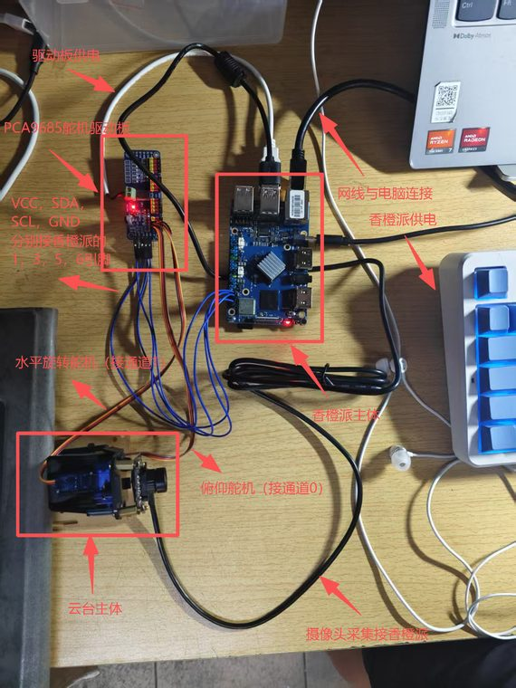
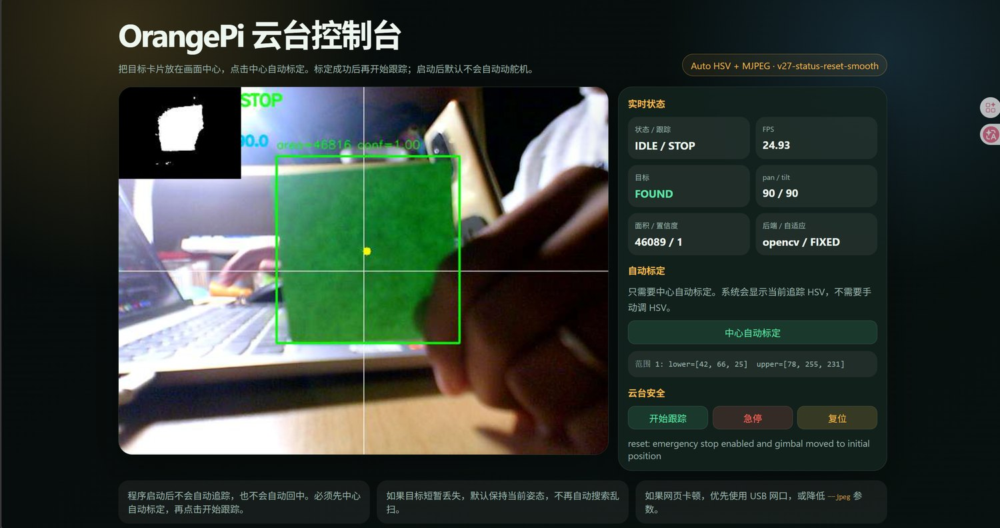
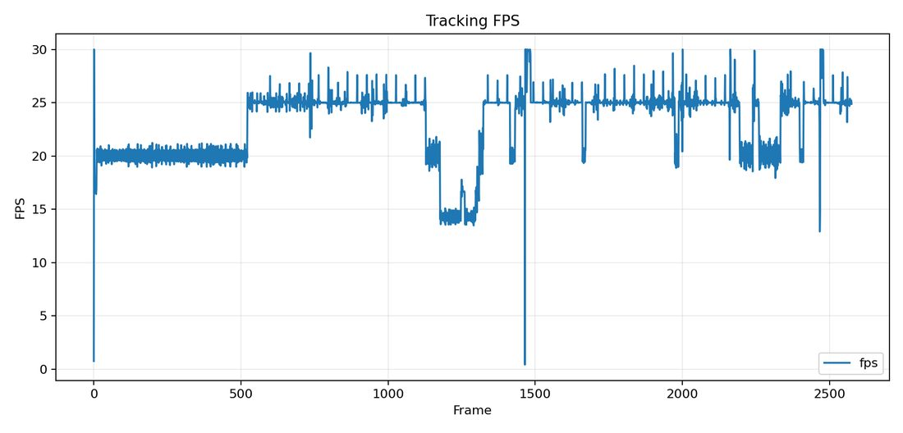
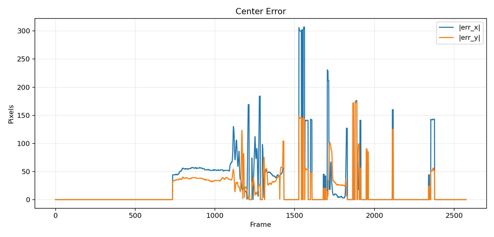
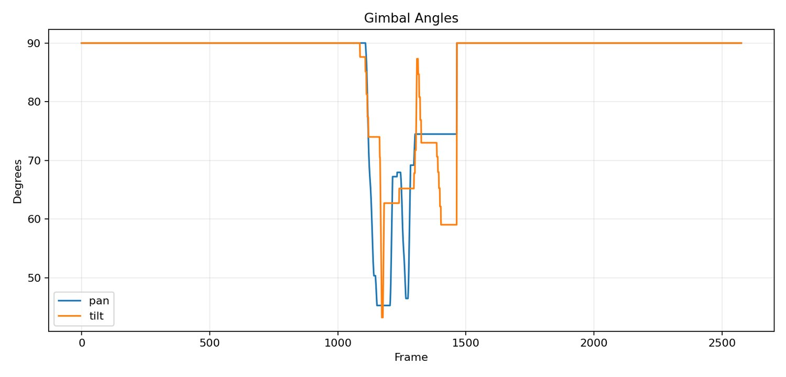
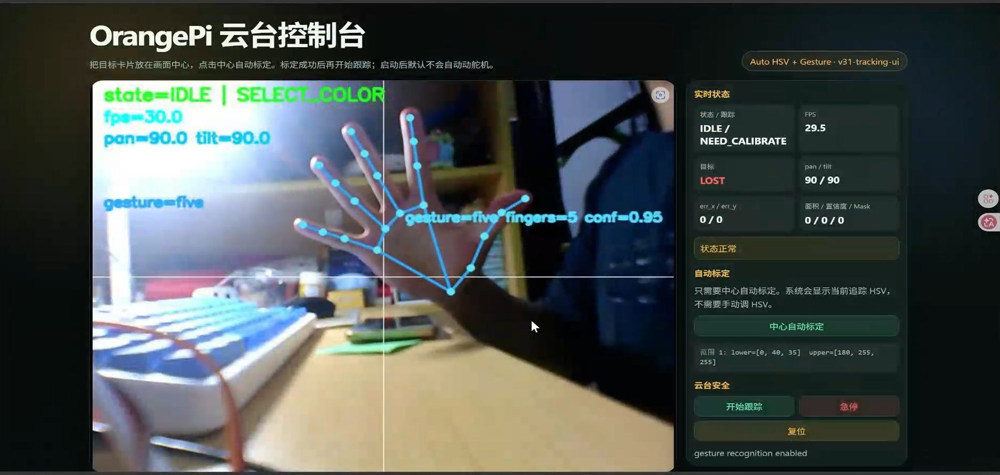
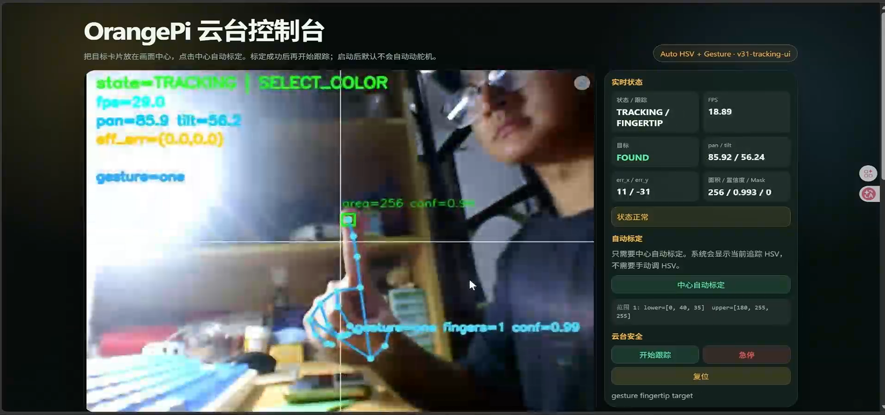
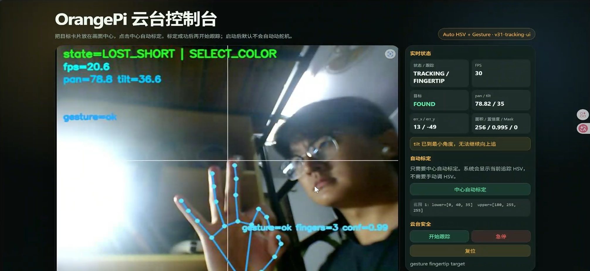

# OrangePi Two-Axis Visual Tracking Gimbal

本项目为“综合设计实践 B”课程大作业成果，完成了基于 OrangePi 5 Pro / RK3588S、USB 摄像头、PCA9685 舵机驱动板和两自由度云台的实时目标跟踪系统。系统在 OrangePi 端完成图像采集、目标检测、云台控制、状态记录和网页监控，能够识别高对比便利贴目标，并驱动 pan / tilt 双舵机使目标中心保持在画面中心附近。

项目主入口为网页控制台。浏览器端可查看实时视频、检测框、目标中心、画面中心线、FPS、目标误差、云台角度、HSV 信息、目标面积和置信度，并可执行中心自动标定、开始跟踪、急停和复位操作。系统同时实现了 C++ wheel 视觉算子加速、pymp 并行对比、mock 云端上传、手势识别、指尖云台跟踪与运动可视化等扩展功能，形成了可演示、可复现、可量化分析的课程提交版本。

## 目录结构与文件说明

```text
tracker_project/
├── README.md                                  # 项目总说明，包含系统目标、目录结构、运行流程、创新点和实验结果
├── main.py                                    # 程序统一入口，支持 track / camera-test / servo-test / web 等模式
├── requirements.txt                           # OrangePi 虚拟环境使用的 Python 依赖列表
├── OrangePi云台目标跟踪系统课程报告.pdf         # 最终课程报告 PDF，位于根目录便于提交与查阅
├── OrangePi云台目标跟踪系统答辩PPT.pptx        # 最终答辩 PPT，位于根目录便于课堂汇报
├── configs/
│   └── default_config.json                    # 摄像头、视觉检测、云台控制、网页服务和硬件驱动参数
├── cpp_accel/                                 # C++/pybind11 加速模块，用于构建 morphology wheel 并进行性能对比
│   ├── setup.py                               # C++ 扩展编译配置
│   └── src/morphology_ext.cpp                 # 二值 mask 形态学处理 C++ 实现
├── docs/
│   ├── TEST_COMMANDS.md                       # 板端部署、运行、硬件检查、主线测试和创新点验证命令
│   ├── wiring_table.xlsx                      # OrangePi、PCA9685、舵机、电源和摄像头详细接线表
│   ├── assets/                                # README 引用的接线图、网页截图、曲线图和 benchmark 图片
│   └── 报告/                                  # 可编辑报告工程、LaTeX 源码、报告图片、演示视频和模板文件
│       ├── media/images/                      # 报告与 README 使用的实物接线、网页、手势和运行截图
│       ├── media/videos/                      # 模拟运行、真实跟踪、扩展模块和答辩演示视频
│       └── orange_pi_tracker_report/          # LaTeX 报告工程，可直接在 TeXstudio 中打开 main.tex
├── scripts/
│   ├── run/                                   # OrangePi 端一键运行脚本，覆盖环境检查、硬件检查和主线运行
│   ├── analyze_tracking_logs.py               # 分析 logs，生成 FPS、中心误差、舵机角度等统计结果
│   ├── benchmark_morphology.py                # 对比 Python / OpenCV / C++ wheel / pymp 四种形态学后端
│   ├── mock_cloud_server.py                   # 本地 mock 云端服务，用于验证网络编程与数据上传流程
│   └── upload_latest_summary.py               # 上传最新跟踪摘要和 benchmark 结果到 mock 云端服务
├── src/
│   └── orangepi_tracker/                      # 核心源码包，包含视觉、控制、硬件、网页、日志和扩展模块
├── tests/                                     # 自动化测试与板端辅助测试脚本
├── logs/                                      # 板端运行日志目录，默认不提交到 Git
├── benchmark_results/                         # benchmark 输出目录，默认不提交到 Git
└── cloud_uploads/                             # mock 云端上传结果目录，默认不提交到 Git
```

## 项目交付材料

- GitHub 仓库：[yys806/zb_tracker_project](https://github.com/yys806/zb_tracker_project)
- 演示视频：[百度网盘](https://pan.baidu.com/s/1XZiJAh4sCwHBI5ZsC6_X-w?pwd=fva9)
- 课程报告 PDF：[OrangePi云台目标跟踪系统课程报告.pdf](OrangePi云台目标跟踪系统课程报告.pdf)
- 答辩 PPT：[OrangePi云台目标跟踪系统答辩PPT.pptx](OrangePi云台目标跟踪系统答辩PPT.pptx)
- 完整命令文档：[docs/TEST_COMMANDS.md](docs/TEST_COMMANDS.md)
- 硬件接线表：[docs/wiring_table.xlsx](docs/wiring_table.xlsx)
- 可编辑报告工程：[docs/报告/orange_pi_tracker_report](docs/报告/orange_pi_tracker_report)
- 本地图片素材：[docs/报告/media/images](docs/报告/media/images)
- 本地演示视频：[docs/报告/media/videos](docs/报告/media/videos)

## 效果预览

| 实际接线 | 网页真实跟踪 |
| --- | --- |
|  |  |

| FPS 曲线 | 中心误差曲线 | 云台角度曲线 |
| --- | --- | --- |
|  |  |  |

| 手势识别 | 指尖跟踪 | OK 复位 |
| --- | --- | --- |
|  |  |  |

本地视频素材已按功能整理：`demo_step03_simulation.mp4` 为网页模拟模式，`demo_step04_tracking.mp4` 为真实闭环跟踪，`demo_modules_extended.mp4` 为扩展模块综合演示，`demo_final_defense.mp4` 为最终答辩演示视频。

## 硬件配置

| 项目 | 当前配置 |
| --- | --- |
| 主控板 | OrangePi 5 Pro / RK3588S |
| 摄像头 | USB 摄像头，接入 OrangePi |
| 舵机驱动 | PCA9685 16 路 PWM 舵机驱动板 |
| I2C 总线 | `/dev/i2c-1` |
| PCA9685 地址 | `0x40`，All-Call 地址 `0x70` |
| 舵机通道 | `channel 0 = tilt`，`channel 1 = pan` |
| Python 环境 | `/home/orangepi/.venvs/zb` |
| OrangePi 项目目录 | `/home/orangepi/zb/tracker_project` |

## 系统运行流程

OrangePi 端进入项目目录：

```bash
cd ~/zb/tracker_project
```

环境检查：

```bash
bash scripts/run/01_env_check.sh
```

硬件检查：

```bash
bash scripts/run/02_hardware_check.sh
```

网页控制台模拟模式，不驱动真实舵机：

```bash
bash scripts/run/03_web_console_simulate.sh
```

网页控制台真实模式，驱动真实舵机完成目标跟踪：

```bash
bash scripts/run/04_web_console_real.sh
```

浏览器访问地址为：

```text
http://<OrangePi-IP>:5000
```

网页启动后系统处于待标定状态。运行流程为：将便利贴目标放在画面中心，点击“中心自动标定”；检测框稳定后点击“开始跟踪”；运行过程中可使用“急停”暂停云台动作，使用“复位”使云台回到初始姿态。

网页视频码率可通过脚本参数调整：

```bash
bash scripts/run/04_web_console_real.sh --jpeg 45 --fps 30
bash scripts/run/04_web_console_real.sh --jpeg 40 --fps 20
```

## 创新点验证

### 创新点 1：C++ wheel 视觉算子加速

项目将二值 mask 形态学开闭运算使用 C++/pybind11 实现，并封装为 Python 可调用 wheel。该模块与 Python、OpenCV、pymp 后端使用相同输入输出，能够进行统一 benchmark。

```bash
bash scripts/run/05_cpp_benchmark.sh
```

### 创新点 2：网页控制台与网络编程

OrangePi 端提供 HTTP 服务、MJPEG 视频流和 JSON 控制接口，电脑端通过浏览器完成实时监控和控制。该设计避免依赖 X11 图形转发，并将目标框、中心点、HSV、FPS、云台角度和安全控制集中在同一界面。

### 创新点 3：pymp 并行加速对比

项目实现 pymp 后端并进行实测对比，用实验结果说明小粒度图像算子并不适合简单并行化，任务加速需要结合计算粒度和数据同步开销综合设计。

```bash
bash scripts/run/06_pymp_benchmark.sh
```

### 创新点 4：mock 云端服务

项目实现本地 mock 云端服务，将最新跟踪摘要和 benchmark 结果通过 HTTP POST 上传为结构化 JSON，验证了网络编程和云端数据关联流程。

```bash
bash scripts/run/07_mock_cloud_upload.sh
```

### 创新点 5：云台安全保护

系统实现角度限位、单帧限幅、死区抑制、急停、平滑复位、PWM 释放和启动不乱动等保护机制，降低舵机持续顶死、突然大幅运动和复位卡顿风险。

### 创新点 6：手势识别、指尖跟踪与运动可视化

系统扩展了手势识别、指尖云台跟踪、光流箭头、轨迹回放、区域热力图、画面质量指标和事件日志展示，使网页控制台能够呈现目标运动过程和系统状态。手势识别优先使用 MediaPipe Hands，依赖不可用时回退到传统轮廓方案；开启手势识别后，连续识别到 `one` 手势会进入指尖跟踪模式，云台以食指尖关键点为目标使其靠近画面中心，连续识别到 `ok` 后停止该模式并执行安全复位。

## 实验结果

三组真实网页跟踪运行日志显示，系统平均 FPS 稳定在 23 FPS 左右。代表性运行 `20260524_013921` 的统计结果如下：

| 指标 | 数值 |
| --- | --- |
| 总帧数 | 2576 |
| 平均 FPS | 23.112 |
| 目标找到率 | 36.80% |
| 平均水平中心误差 | 68.91 px |
| 平均垂直中心误差 | 44.70 px |
| 最大水平中心误差 | 307.00 px |
| 最大垂直中心误差 | 174.00 px |
| 目标丢失次数 | 2 |
| 平均重新捕获时间 | 0.764 s |
| 搜索状态触发次数 | 0 |

该组日志包含目标移出画面、按钮操作、遮挡观察等完整调试过程，因此找到率反映的是实际调试全流程，而不是目标持续可见条件下的单独成功率。系统已同时提交演示视频、运行截图、日志摘要和曲线图，用于复核实际运行效果。

C++ wheel benchmark 结果如下：

| 后端 | 平均耗时 / ms 每帧 | 相对 Python 加速比 | 输出是否匹配 OpenCV |
| --- | ---: | ---: | --- |
| Python | 57.301 | 1.00x | 是 |
| OpenCV | 0.044 | 1291.67x | 是 |
| C++ wheel | 0.353 | 162.54x | 是 |
| pymp | 356.775 | 0.16x | 是 |

实验说明 C++ wheel 相比纯 Python 有明显加速，且输出与 OpenCV 一致；OpenCV 仍保持最高速度，原因是其形态学算子本身已经是高度优化的 C/C++ 实现。pymp 在本任务中速度下降，说明小粒度算子的并行调度和共享数组开销超过计算收益。

## 技术路线

系统采用“传统视觉稳定闭环 + 网页控制台 + 可量化创新点”的技术路线。主线检测算法基于 HSV 自动标定、mask 生成、形态学开闭运算、轮廓筛选、正方形程度约束、填充率约束和上一帧连续性约束。控制算法使用水平和垂直误差分别驱动 pan / tilt 舵机，并加入死区、限幅、平滑、最小有效角度变化和角度限位。

项目未将 DNN/RKNN 作为当前主线。当前验收目标强调现场稳定运行、可量化日志、可复现实验和课程加分项落地；在高对比便利贴目标场景下，传统视觉方案具备更低延迟和更高可控性。DNN/RKNN 在本项目中定位为扩展储备，用于更复杂目标类别和背景条件下的检测任务。

## 运行说明

- 板端运行使用虚拟环境 `/home/orangepi/.venvs/zb`，脚本已统一调用该环境中的 Python。
- 真实跟踪以网页控制台为主入口，本地 OpenCV 窗口模式仅保留为辅助能力。
- 摄像头接入 OrangePi，不接入电脑；电脑通过浏览器访问 OrangePi 网页控制台。
- `logs/`、`benchmark_results/`、`cloud_uploads/` 为运行产物目录，默认不提交到 Git。
- 完整运行命令和异常处理流程见 [docs/TEST_COMMANDS.md](docs/TEST_COMMANDS.md)。
